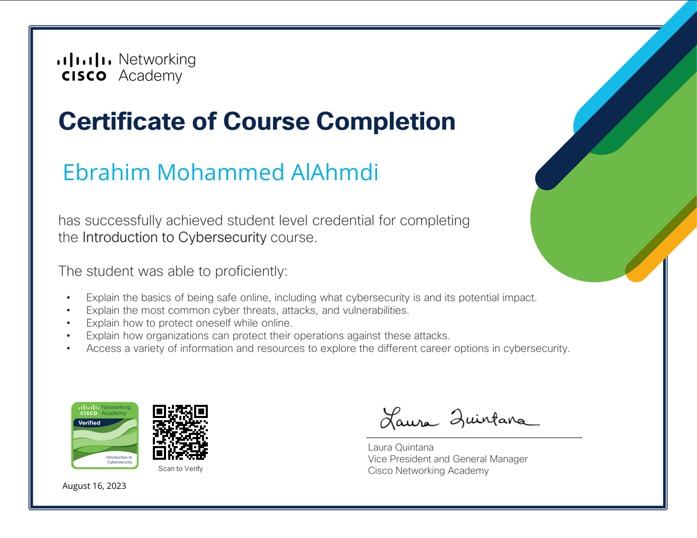

# 🎓 My Certifications Showcase | From Continuous Learning Journey

Welcome 👋 to my **Certifications Showcase Repository**!  

This repository serves as a **personal archive** of my certifications and professional achievements — reflecting my **continuous journey of growth and learning** in the fields of **technology, programming, and network administration**.

---

<!--

## 🧾 About This Repository
## 📜 Available Certifications
-->

<!--

## 📜 About This Repository

This repository is designed to:

- 🗂 **Organize and present** all my certifications in a clean, structured, and professional format.  
- 🚀 **Showcase my learning progress** across multiple technical domains.  
- 🔗 Provide a **verifiable reference** that can be linked in my resume or professional profiles.

-->

## 📜 About This Repository

This repository was created with the aim of:

- 🗂 **Organizing and showcasing my certificates** in an elegant and well-structured manner.  
- 🚀 **Highlighting my progress** in learning across various technical fields.  
- 🔗 Creating a **reliable reference** that can be shared through a résumé or professional networking platforms.  

---

## 🏅 Certifications

### 1. 🛡 Cisco — Introduction to Cybersecurity  

This certification represents my **first step into the world of Cybersecurity**, exploring digital threats, core security principles, and protection strategies for users and systems.

**📷 Certificate Preview:**  
 

**🔗 View Full Certificate (PDF):**  
[Click here to open](./certificates/introduction-to-cybersecurity/introduction-to-cybersecurity.pdf)

 

---
